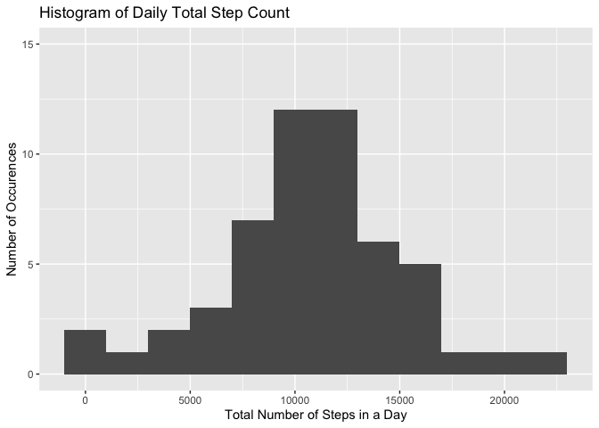
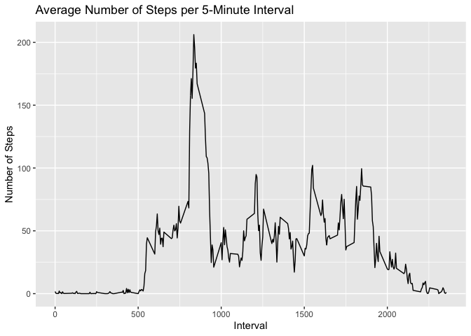
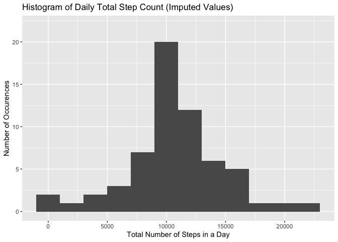
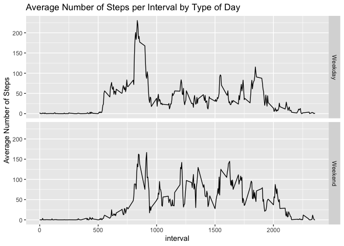

### Require dependencies

Loads all required dependencies to run analysis

```r
library(data.table)
library(dplyr)
library(ggplot2)
```

### 1. Reading the Data

Checks if data directory exists. If not, creates directory


```r
if(!file.exists('./99_data')){
        dir.create('./99_data')
}
```

Checks if activity data exists in file. If not, downloads file and extracts data.
If file was downloaded, deletes the .zip file.


```r
if(!file.exists('./99_data/activity.csv')){
        url <- 'https://d396qusza40orc.cloudfront.net/repdata%2Fdata%2Factivity.zip'
        download.file(url, destfile = './99_data/data.zip')
        unzip('./99_data/data.zip', exdir = './99_data', overwrite = TRUE)
        file.remove('./99_data/data.zip')
}
```

Reads data into a data table called 'raw_data'

```r
raw_data <- as.data.table( 
                read.csv(
                        './99_data/activity.csv',
                        header = TRUE,
                        sep = ',',
                        na.strings = 'NA'
                        )
)
```

Adjust column classes and remove NAs and store result in 'data'

```r
data <- na.omit(raw_data)
data$date <- as.Date(data$date)
```

Gets structure of data table 'data'

```r
str(data)
```

```
## Classes 'data.table' and 'data.frame':	15264 obs. of  3 variables:
##  $ steps   : int  0 0 0 0 0 0 0 0 0 0 ...
##  $ date    : Date, format: "2012-10-02" "2012-10-02" ...
##  $ interval: int  0 5 10 15 20 25 30 35 40 45 ...
##  - attr(*, ".internal.selfref")=<externalptr>
```

### 2. Histogram of Steps per day

Summarize data into days and sum up steps per day
Store data in new Variable 'stepsPerDay'


```r
stepsPerDay <- data %>%
        group_by(date) %>%
        summarize(totalStepCount = sum(steps))
```

Plots data of 'stepsPerDay' in histogram
Set y-axis limits and titles


```r
qplot(
        x = stepsPerDay$totalStepCount,
        geom = "histogram",
        binwidth = 2000,
        ylim = c(0,15),
        ylab = 'Number of Occurences',
        xlab = 'Total Number of Steps in a Day',
        main = 'Histogram of Daily Total Step Count'
)
```

<!-- -->

### 3. Mean and median number of steps taken each day

Calculate average number of steps and store in new variable 'meanSteps'


```r
meanSteps <- mean(stepsPerDay$totalStepCount)
```

Calculate median number of steps and store in new variable 'medianSteps'


```r
medianSteps <- median(stepsPerDay$totalStepCount)
```

The mean number of steps is **10766** and the median is **10765**

### 4. Time Series Plot of the Average Number of Steps Taken
Summarize data into 5-minute intervals and calculate average
Store data in new Variable 'intervalAverage'


```r
intervalAverage <- data %>%
        group_by(interval) %>%
        summarize(averageStepCount = mean(steps))
```

Plot graph of average steps in each 5-minute interval
Set titles

```r
qplot(
        x = intervalAverage$interval,
        y = intervalAverage$averageStepCount,
        geom = 'line',
        main = 'Average Number of Steps per 5-Minute Interval',
        xlab = 'Interval',
        ylab = 'Number of Steps'
        
)
```

<!-- -->

### The 5-minute interval that, on average, contains the maximum number of steps

Filter 'intervalAverage' to return max averageStepCount and store in variable 'maxSteps'


```r
maxSteps <- filter(
        intervalAverage,
        averageStepCount == max(averageStepCount)
        )
```

The interval with the most steps on average is interval **835**


### 6A. Code to describe and show a strategy for imputing missing data

Calculate the tital number of missing values in the original data set

```r
totalMissing <- sum(is.na(raw_data$steps))
```
There are **2304** missing values in the original data set

Missing values during a specific interval will be imputed by using the average step count for that interval


```r
full_data <- raw_data
for (i in 1:nrow(full_data)){
        if (is.na(full_data$steps[i])){
                replacementValue <- filter(intervalAverage, interval == full_data$interval[i])
                full_data$steps[i] <- replacementValue$averageStepCount
        }
}
```

Check that all NAs have been removed


```r
        sum(is.na(full_data$steps)) == 0
```

```
## [1] TRUE
```

Make sure to coerce dates into dates

```r
full_data$date <- as.Date(full_data$date)
```

### 7. Histogram of Steps per day after imputing missing values

Summarize data into days and sum up steps per day
Store data in new Variable 'stepsPerDayFull'


```r
stepsPerDayFull <- full_data %>%
        group_by(date) %>%
        summarize(totalStepCount = sum(steps))
```

Plots data of 'stepsPerDayFull' in histogram
Set y-axis limits and titles


```r
qplot(
        x = stepsPerDayFull$totalStepCount,
        geom = "histogram",
        binwidth = 2000,
        ylim = c(0,22),
        ylab = 'Number of Occurences',
        xlab = 'Total Number of Steps in a Day',
        main = 'Histogram of Daily Total Step Count (Imputed Values)'
)
```

<!-- -->

### 7A. Mean and median number of steps taken each day (including imputed values)

Calculate average number of steps and store in new variable 'meanStepsFull'


```r
meanStepsFull <- mean(stepsPerDayFull$totalStepCount)
```

Calculate median number of steps and store in new variable 'medianStepsFull'


```r
medianStepsFull <- median(stepsPerDayFull$totalStepCount)
```

The mean number of steps is **10766** and the median is **10766**

### 8. Panel plot comparing the average number of steps taken per 5-minute interval across weekdays and weekends

Add weekDay identifier to 'full_data'


```r
full_data$weekDay <- weekdays(full_data$date)
```

Add boolean value to identify weekend and store in 'isWeekend' column


```r
full_data$isWeekend <- FALSE
full_data$isWeekend[full_data$weekDay %in% c('Saturday', 'Sunday')] <- TRUE
```

Summarize data by weekend and interval values and calculate average steps


```r
intervalAverageDay <- full_data %>%
        group_by(interval, isWeekend) %>%
        summarize(averageStepCount = mean (steps))
```

Make a plot comparing weekdays to weekends and store in variable 'p'

```r
p <- qplot(interval, averageStepCount, data = intervalAverageDay,
      type = 'line',
      geom = 'line',
      xlab = 'interval',
      ylab = 'Average Number of Steps',
      main = 'Average Number of Steps per Interval by Type of Day',
      )
```

Add facets and facet labels, using ggplot2


```r
weekendLabel <- c('Weekday', 'Weekend')
names(weekendLabel) <- c(FALSE, TRUE)

p + facet_grid(
        facets = isWeekend ~ .,
        labeller = labeller(isWeekend = weekendLabel))
```

<!-- -->
